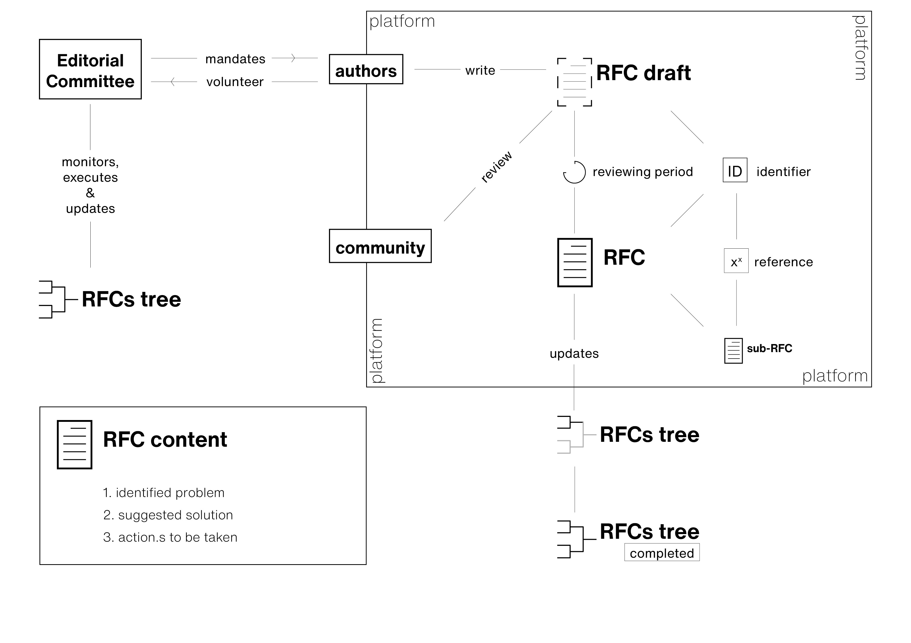

# RFC-0000: RFC on RFCs

## Motivation

Reaching consensus on the technology options to follow in a programme as large as Time Machine is a complex issue. To ensure the open development and evaluation of work, a process inspired by the Request for Comments (RFC) that was used for the development of the Internet protocol1 will be adapted to the needs of Time Machine. Time Machine Requests for Comments will be freely accessible publications, identified with a unique ID, constituting the main process for establishing rules, recommendations, core architectural choices for the Time Machine components.

## Solution

**Basic principles :**

·   *Accessibility* - TM RFC are freely accessible, free of charge. 

·   *Openness* - Anybody can write a TM RFC.

·   *Identification* - Each TM RFC, once published, has a unique ID and no changes are allowed after publication. Any important changes result in a subsequent TM RFC. For this reason, some TM RFCs could be tagged as obsolete. 

·   *Incrementalism* - Each TM RFC should be useful for its own right and act as a building block to others. Each TM RFC must be aimed as a contribution, extension or revision of the TM infrastructure. 

·   *Standardisation and linguistic diversity* - TM RFCs should aim to make use of standardised terms to improve the clarity level of its recommendation but can be written in any language. 

·   *Scope* - TM RFCs are designed contribution and implementation solutions solving practical problems. TM RFC are not research papers and may not necessarily contain experimental evidence. 

·   *Self-defining process* - Like for the development of the Internet, TM RFC could be the main process for establishing TM Rules, TM Recommendations, TM Standard Metrics but also the processes and roles for managing TM RFCs themselves.

## Operation 

- The RFC Editorial Committee appoints authors to Write RFC planned in the **RFCs tree**. Or alternatively authors contact the RFC Editorial Committee to candidate to write a RFC (planned in the **RFCs tree** or not)
- The authors produces a RFC draft which is reviewed first by the RFC Editorial Committee for coherence with the rest of the RFC corpus and then by a larger community. The RFC is revised and possibly re reviewed. 
- Once accepted by the RFC Editorial Committee it receives an official identifier and is published official as an authored peer-reviewed publications 
- The **RFCs tree** is adapted with the published RFC and possible sub-RFC planned in the writing of the new RFC.

See **RFC-0003 RFC on Editorial Committee** and **RFC-0004 RFC on Publication Platform**
