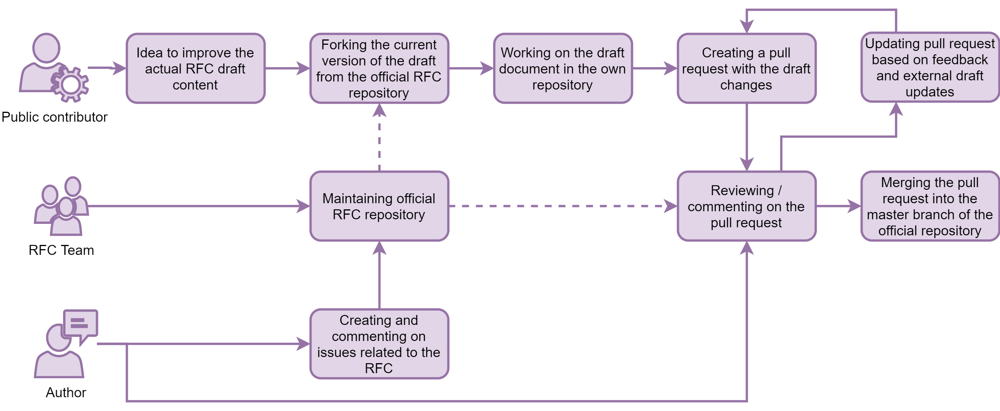
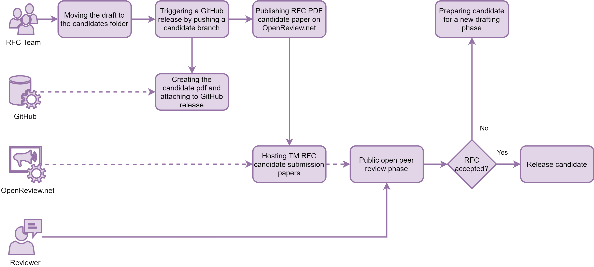
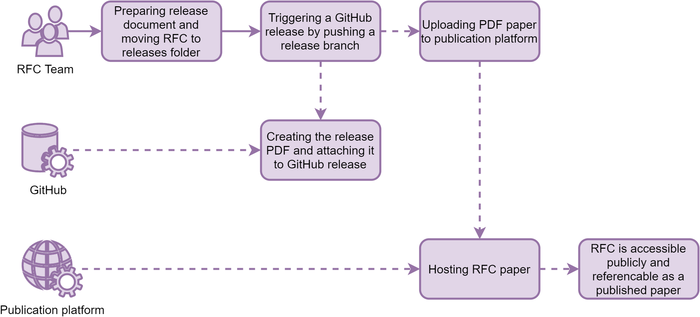

# Motivation

This Request for Comments (RFC) describes the inner workings and technical details of the RFC platform itself. It aims to provide the technical framework for authorship, review, community contribution and publication of all future Time Machine RFCs.

# Introduction

The Time Machine *Requests for Comments* (RFC) workflow is based on Git[^git_website]: a tool initially designed by Github[^github_about] and multiple developers to track changes to source code. It is currently the leading place to host open-source projects and to create and collaborate on software and many other kinds of projects. The contribution and review process used by RFCs builds upon the basic *forking* workflow that "is most often seen in public open source projects"[^bitbucket_forking]. This ensures that contributions will be tracked indefinitely, review decisions are documented correctly and that it will always be possible to access and reference obsolete versions of the RFC drafts.

The choice of this solution is motivated by the possibility to scale the number of users and contributions over time. It is likely that releasing and updating RFCs will ultimately be akin to maintaining a large source code base.

In addition to the git-based workflow, TM RFCs will also enable people who are not familiar with Git and the related tools to participate in additional ways, for instance by reviewing candidate RFCs which will be published as papers on the open peer review platform OpenReview.net.

# Definitions

Before describing the workflow in detail, this section gives an overview on the most important design decisions and distinct parts of the platform:

+ All technical and content-related aspects of the RFCs are managed by the RFC Editorial Committee, which is appointed by the Time Machine Organisation (TMO) board.
+ RFCs can be proposed either by the RFC Editorial Committee, by authors appointed by the TMO or by any other interested author from the general public. An author can be an individual person or a group of persons working together on a single RFC draft.
*Note*: When this document refers to an 'author' it applies to both individuals and groups of authors.
+ Any accepted RFC proposal will be assigned an identifier by the RFC Editorial Committee. Identifiers are based on the pattern `RFC-[number]`. The identifiers contain leading zeros to ensure they meet the mandatory four digit length. For example, this RFC is called `RFC-0003`, pronounced as *RFC-three*.
+ RFCs are drafted in Markdown[^orig_markdown_syntax] -- more specifically, in the extended syntax used by Pandoc[^pandoc_markdown]: a tool to convert texts between different file formats.
+ RFC documents are managed in Git and are hosted in a single repository on GitHub. Public contributions will be possible via issues, comments and pull requests. The RFC Editorial Committee is responsible for the maintenance of the repository.
+ The drafting process takes place and is therefore documented on the `master` branch of the main RFC repository[^main_repo_url].
+ Content contributions to an RFC can be made by creating a fork[^github_forking] of the official RFC repository and then submitting all modifications in the form of a GitHub Pull-Request[^github_pullrequest] containing the relevant changes to the repository.
+ Documents in the RFC repository are prepared in directories and files named according to the RFC number, for example `RFC-0003/RFC-0003.md`.
+ The lifecycle phases for an RFC are `draft`, `release candidate` and `release`.
+ Draft phases will be open to the public for two weeks.
+ Review phases will have a duration of four weeks.
+ Drafts are stored in the `files/drafts` folder, release candidates in the `files/candidates` folder and released RFCs in the `files/releases/` folder.
+ In addition to the documents in the RFC repository, candidates and releases will be converted into PDF files using the above-mentioned Pandoc. These PDF files will be amended with the time of conversion as well as a unique release number, then stored in the form of a GitHub Release[^github_release] with the PDF files attached as release assets.
*Note*: It is to be expected that the automatic file preview for Markdown files on GitHub (and possibly in other tools as well) will differ from the final PDF files, as Pandoc enables advanced features like footnotes which are not used by GitHub and their preferred Markdown dialect.[^gfm]
+ Release candidates will be published and reviewed on OpenReview.net[^openreview_about].
+ Releases will be provided with a DOI and published on the open-access repository Zenodo[^zenodo].

# Workflow phases

This section describes the progression of the RFC from an initial idea to its final release as a citable PDF paper.

## Phase 1: Conception

Ideas for RFCs can come from the RFC Editorial Committee and/or public authors. Authors with an idea for a potential RFC should contact the RFC Editorial Committee to coordinate the initial conception and drafting process. After acceptance of an RFC idea, the RFC Editorial Committee will assign an identifier and prepare the draft file from a standardised template, placing it in the `files/drafts/[RFC-id]/` folder in the official RFC repository.

Following this step, the draft author will create a new fork of the official repository or pull the latest changes into their pre-existing fork, then begin to work on the initial version of the RFC draft.

After the initial drafting process is finished and the draft is ready to be shared with the public, the draft author will create a pull request containing the initial version of the draft from their private fork to the official repository.

The RFC Editorial Committee will then conduct a brief internal review of the initial draft to formally ensure the suitability of the document. After this process is concluded and any necessary changes are made by the draft author in the original pull request, the pull request is merged into the master branch of the official repository and the public drafting phase begins.

## Phase 2: Public drafting

The drafting of an RFC is designed as a process that enables direct contributions by both members of the RFC Editorial Committee and the general public. Over a fixed period of time, all contributors can work on improvements to the draft text and propose and review changes. The fork-and-pull-request-workflow on GitHub ensures that each contribution is registered and stored in the official repository indefinitely.

The official drafting phase begins with the merging of the initial RFC draft by the RFC Editorial Committee and extends for a period of two weeks. The main RFC Markdown document and accompanying files, for example images, are stored in the `files/drafts/[RFC-id]` folder for the duration of the drafting phase.

Persons interested in contributing to the text directly, either by additions or changes to the existing content, can create a new fork (a full copy) of the official repository or pull the current state of its master branch into their own pre-existing fork. They can then either: use the inline editor on the GitHub website to change the content of the RFC document in their own forked repository, or clone their repository to their computer and use a Markdown editor / Git client of their choice to work with the files.

Changes to the RFC draft can be submitted at any time during the drafting phase in the form of pull requests from the forked repository to the so-called upstream repository, that is the official RFC repository. This enables the RFC Editorial Team and other contributors to review the proposed changes, suggest editions or point out problems directly next to the provided version of the draft document.

All pull requests to the official RFC repository during the drafting phase can be reviewed by any contributor; however, to be accepted and to be merged, favourable reviews by at least three appointed reviewers will be necessary. These reviewers are appointed by the RFC Editorial Committee based on the area of expertise into which the RFC falls. After a pull request passes its review, it is accepted and will be merged into the master branch of the RFC repository by the RFC Editorial Committee, making the merged version the most recent official version of the draft. Additional pull requests which are open at the same time will automatically be compared to this new version, and they will thus need to be amended by the contributors if necessary to solve potential conflicts with the new official version.

Merged pull requests will trigger a `GitHub Action`[^github_action] that compiles the current version of all open draft documents and attaches them as a ZIP file accessible in workflow job details[^github_job_details]. These preview files are available for 90 days.

Another way for potential contributors, namely those who are not familiar with Markdown writing and the Git-based workflow, to contribute are the so-called GitHub Issues[^github_issues]. These are commonly used to give users the possibility of reporting software bugs to project developers and to track prending tasks. In the TM RFCs issues can be created by any person who would like to simply report a problem with the current version of the draft or to discuss specific topics or ideas related to the RFC. It is the responsibility of the RFC author to react to these issues incumbent upon the the RFC Editorial Committee to moderate issues as necessary.

## Phase 3: Release candidate review

After completion of the drafting phase and after all open pull requests containing changes to the draft are either merged or rejected, the final version of the draft will be turned into the first release candidate by the RFC Editorial Committee. However, if necessary, the TM Editorial Committee in combination with the appointed reviewers also have the option to abort the RFC drafting process. All being okay, the RFC Editorial Committe will update the list of authors / contributors in the document and move it from `files/drafts` to `files/candidates`.

To trigger the automatic release of the candidate, the RFC Editorial Committee commits and pushes the draft-turned-candidate onto a new branch[^github_branches] in the main repository. The branch name will follow the pattern `[RFC-id]_candidate_[version_number]`. The version number will be assigned by the RFC Editorial Committee and will follow semantic versioning[^semver]. This step triggers an automatic process in GitHub that converts the Markdown document into an RFC candidate PDF document with an integrated version and timestamp, then publishes it in the form of a GitHub release.

The PDF file created in this step will be uploaded by the RFC Editorial Committee as a submission in the RFC section of the virtual venue "TimeMachine" on the open peer review platform OpenReview.net[^openreview_timemachine]. The submission will be open for four weeks during which users on OpenReview will have the opportunity to use the integrated tools to review the candidate or to comment on it. This step ensures a scientifically sound RFC release and enables reviewers to use tools they are familiar with from other academic review processes.

Contributors are encouraged to participate on OpenReview during this time, and discussions in GitHub issues are still possible. However, pull requests on release candidates will not be accepted.

Depending on the result of the release candidate review process, the RFC will either progress to the official release phase, return to the drafting phase for refinement or be cancelled altogether if necessary. If an additional drafting phase is necessary, the document will be moved back to `files/drafts` by the RFC Editorial Committee and pull requests on the `master` branch will once again be considered for merging.

## Phase 4: Official release

If an RFC candidate is accepted by the community during the review phase on OpenReview, it will be prepared for the official release by the RFC Editorial Committee. The list of contributors will be updated as necessary and the document folder will be moved to `files/releases`. This change will be pushed onto a new Git branch that follows the naming pattern `[RFC-id]_release_[version_number]`. Analogous to the candidate phase, the version number will be assigned by the RFC Editorial Committee and will follow semantic versioning. This step will once again trigger the conversion in the form of a versioned and timestamped PDF document that will be published as an asset on a GitHub release.

The finalized release PDF will then be published as an official publication by the Time Machine on Zenodo.

## Phase 5: Updates at a later point

Due to the fact that the RFCs describe all aspect of the Time Machine, additions, amendmendments or changes to existing RFCs can be necessary. In this case, the RFC Editorial Committee will move the RFC file from the `files/releases` folder back to the `files/drafts` folder and a new drafting phase can begin with an amended draft being produced by the new draft authors. It will then follow the usual process through all the different phases described above, resulting in a new release version.

# Q&A

## Question: Do I need a GitHub or an OpenReview.net account to contribute to an RFC?

Yes, you will need a GitHub account if you would like to contribute directly to the text of an RFC, to discuss issues or to comment on pull requests. If you would like to comment on a review candidate on OpenReview.net you will need an account on OpenReview.net. Both tools serve to make attributions of content and comments from individual persons possible and to help to ensure scientific standards for the drafting and review process.

## Question: I have an idea for an RFC. What do I do?

Please contact the RFC Editorial Committee with your idea. They will assist you with the creation an initial draft version of the idea, if it is deemed to be suitable and feasible.

## Question: I would like to fix some errors in an RFC draft. How do I do that?

The easiest way is for you to sign in to your GitHub account, create a fork of the main RFC repository into your own account, fix the error in your forked version of the document, commit it into your repository and open a pull request outlining your changes to the main RFC repository. It will then be visible, can be reviewed and then eventually merged into the main draft document if the changes are accepted by the reviewers.

## Question: I have worked on a draft document myself and would like to preview the final PDF document to see how it would look. How can I do this?

If you follow the official contribution process by forking the main RFC repository, anything you push to the `master` branch in your own repository will be automatically converted into a PDF document by triggering a GitHub action. You can access the ZIP file with the compiled draft documents in the GitHub job details page in the action section.

## Question: How do I see which drafts are currently available for contributions or release candidates open for review?

You can see the current plan of work in the `README` file of the main RFC repository.

<!-- TODO -->

<!-- Footnote content. Only alphanumeric characters and underscores are allowed. Please keep alphabetical sorting -->

[^bitbucket_forking]: <https://www.atlassian.com/git/tutorials/comparing-workflows/forking-workflow>
[^gfm]: GitHub Flavored Markdown (*GFM*) <https://github.github.com/gfm/>
[^git_website]: <https://git-scm.com/>
[^github_about]: <https://github.com/about>
[^github_action]: <https://help.github.com/actions>
[^github_branches]: <https://help.github.com/en/github/collaborating-with-issues-and-pull-requests/about-branches>
[^github_forking]: <https://guides.github.com/activities/forking/>
[^github_issues]: <https://guides.github.com/features/issues/>
[^github_job_details]: <https://help.github.com/en/actions/configuring-and-managing-workflows/persisting-workflow-data-using-artifacts#downloading-or-deleting-artifacts>
[^github_pullrequest]: <https://help.github.com/en/github/collaborating-with-issues-and-pull-requests/about-pull-requests>
[^github_release]: <https://help.github.com/en/github/administering-a-repository/about-releases>
[^main_repo_url]: <https://github.com/time-machine-project/requests-for-comments>
[^openreview_about]: <https://openreview.net/about>
[^openreview_timemachine]: <https://openreview.net/group?id=TimeMachine.eu/RFC>
[^orig_markdown_syntax]: <https://daringfireball.net/projects/Markdown/syntax>
[^pandoc_markdown]: <https://pandoc.org/MANUAL.html#pandocs-Markdown>
[^semver]: <https://semver.org/>
[^zenodo]: <https://zenodo.org/>
